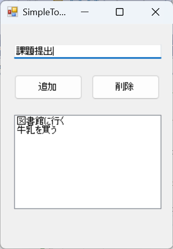

# SimpleTodoApp
C#で作った簡単なTODOアプリ

## 機能一覧
- タスクの追加
- タスクの削除
- 自動保存（終了時）
- 起動時に前回のタスク読み込み

## 使い方
1. exeをダウンロードして実行
2. TextBoxにタスクを入力して「追加」ボタンを押下するとリストボックスに追加
3. リストボックスからアイテムを選択して「削除」ボタンを押下するとリストボックスから削除

## スクリーンショット

